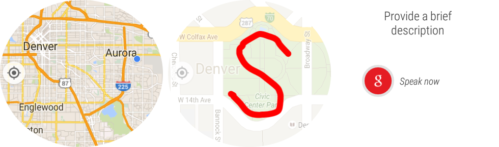

# MAGE Android Wear

10/02/2015

This is the MAGE Android Wear application for Android wearables.

Depends on the [ChronosTouch Library](https://github.com/ngageoint/mage-chronostouch-android).  See the [MAGE client](https://github.com/ngageoint/mage-android) for more information.

MAGE Wear allows users to quickly create observations using gestures on their wearable device.

MAGE Android Wear was developed at the National Geospatial-Intelligence Agency (NGA) in collaboration with BIT Systems. The government has "unlimited rights" and is releasing this software to increase the impact of government investments by providing developers with the opportunity to take things in new directions. The software use, modification, and distribution rights are stipulated within the Apache license.

## How to Build

### Build

./gradlew clean

./gradlew assembleDebug

### Install Over USB

./gradlew installDebug

### Install Over Bluetooth

You will need a android device with android wear installed on it.  And you will need to enable bluetooth debugging:  
adb forward tcp:4444 localabstract:/adb-hub  
adb connect localhost:4444  

Then install the built apk:  
adb -s localhost:4444 uninstall mil.nga.giat.mage
adb -s localhost:4444 install ./magewear/build/outputs/apk/magewear-debug.apk  

## Pull Requests

If you'd like to contribute to this project, please make a pull request. We'll review the pull request and discuss the changes. All pull request contributions to this project will be released under the Apache license.

Software source code previously released under an open source license and then modified by NGA staff is considered a "joint work" (see 17 USC § 101); it is partially copyrighted, partially public domain, and as a whole is protected by the copyrights of the non-government authors and must be released according to the terms of the original open source license.

## License

Copyright 2015 BIT Systems

Licensed under the Apache License, Version 2.0 (the "License");
you may not use this file except in compliance with the License.
You may obtain a copy of the License at

    http://www.apache.org/licenses/LICENSE-2.0

Unless required by applicable law or agreed to in writing, software
distributed under the License is distributed on an "AS IS" BASIS,
WITHOUT WARRANTIES OR CONDITIONS OF ANY KIND, either express or implied.
See the License for the specific language governing permissions and
limitations under the License.
